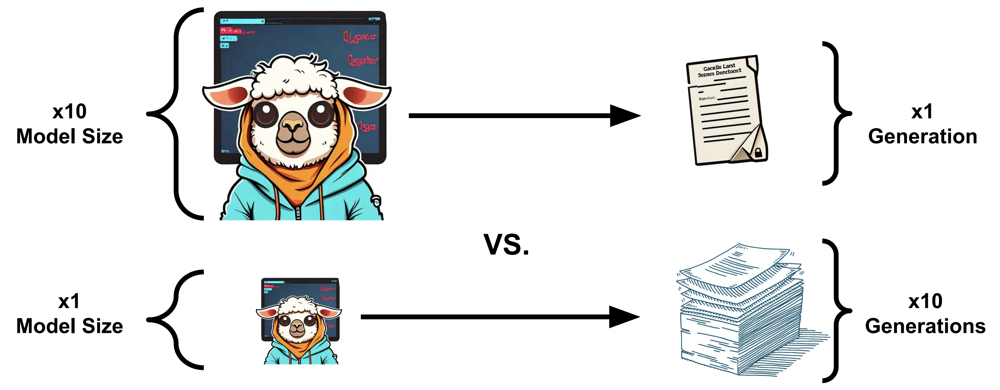

# The Larger the Better? Improved LLM Code-Generation via Budget Reallocation

This is the official repository of the COLM 2024 paper: [The Larger the Better? Improved LLM Code-Generation via Budget Reallocation](https://arxiv.org/abs/2404.00725) by Michael Hassid*, Tal Remez*, Jonas Gehring, Roy Schwartz and Yossi Adi.

<p align="center">
  
</p>

## Data
We release the Code Llama 7B generations for the [HumanEval](https://drive.google.com/file/d/1q_za9hhdPIF-O7_Rse9q5eKsTMitH3Gw/view?usp=sharing) and [MBPP](https://drive.google.com/file/d/1QcBnM9E5Sxf6CrocBvu-OO9ybHYKU7Lk/view?usp=drive_link) benchmarks.

Below we present an example of the data format (json file):
```json
{
    "HumanEval/0": {
        "task_id": "HumanEval/0",
        "prompt": "from typing import List\n\n\ndef has_close_elements(numbers: List[float], threshold: float) -> bool:\n    \"\"\" Check if in given list of numbers, are any two numbers closer to each other than\n    given threshold.\n    >>> has_close_elements([1.0, 2.0, 3.0], 0.5)\n    False\n    >>> has_close_elements([1.0, 2.8, 3.0, 4.0, 5.0, 2.0], 0.3)\n    True\n    \"\"\"\n",
        "samples": [
            {
                "pass_at_1": 100.0,
                "generation": "   for i in range(len(numbers)):\n        for j in range(i + 1, len(numbers)):\n            if abs(numbers[i] - numbers[j]) <= threshold:\n                return True\n\n    return False\n"
            },
            {
                "pass_at_1": 100.0,
                "generation": "   for idx, i in enumerate(numbers):\n        for j in numbers[idx + 1:]:\n            if abs(i - j) <= threshold:\n                return True\n    return False\n"
            },
]
}
}
```

## rank-score@k code

We also provide the python function for calculating the rank-score@k metric. Full details at the paper.


```py
def rank_score_at_k(n, k, pass_sorted):
    """
    :param n: total number of samples
    :param k: k in rank-score@k
    :param pass_sorted: a binary list of pass scores. The list is sorted by the ranks assigned to examples by a ranker.
    """
    numerator_sum = 0
    for i in range(1, n-k+2):
        numerator_sum += math.comb(n-i, k-1) * pass_sorted[i-1]
    score = (numerator_sum / math.comb(n, k)) * 100
    return score
```

## Citation
```
@article{hassid2024larger,
  title={The Larger the Better? Improved LLM Code-Generation via Budget Reallocation},
  author={Hassid, Michael and Remez, Tal and Gehring, Jonas and Schwartz, Roy and Adi, Yossi},
  journal={arXiv preprint arXiv:2404.00725},
  volume={arXiv:2404.00725},
  url={http://arxiv.org/abs/2404.00725},
  year={2024}
}
```
